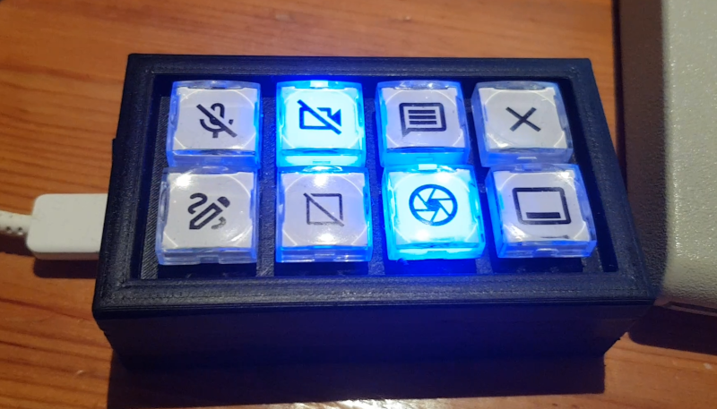
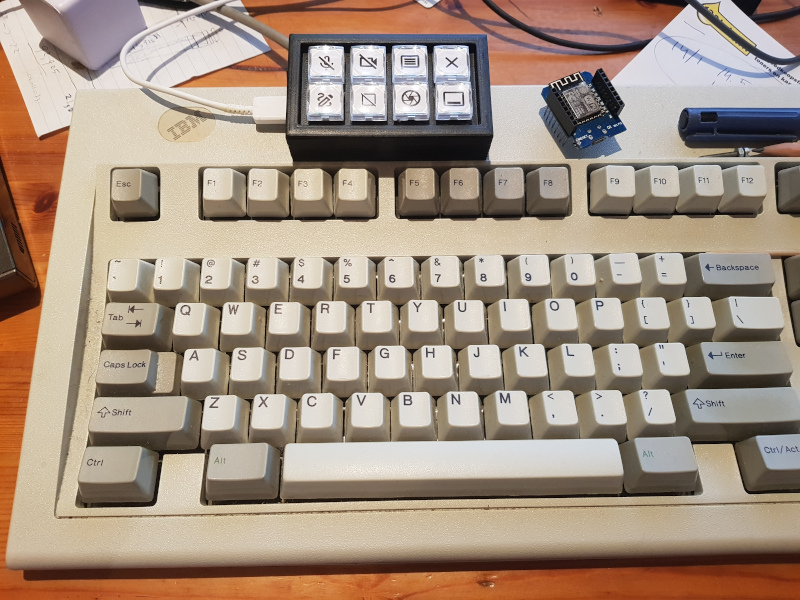

# Macro Keypad

The Macro Keypad is an 8 key USB keyboard, with programmable keys, and a led in each key.
See blog post: https://www.kaper.com/electronics/macro-keypad/ for schematics, more information, and on
how to build this.

## Some images of the end result





## Used components

The next (2) titles are taken from the Aliexpress site, where I ordered the parts:

- Honyone TS26 Series Square With LED Momentary SPST PCB Mini Push Button Tact Switch -->  [12x 0.81 euro, when I bought them].
- PRO MICRO/MINI/TYPE-C USB 5V 16MHz Board Module For Arduino/Leonardo ATMEGA32U4-AU/MU Controller Pro-Micro Replace Pro Mini 1PCS -->  [1x 5.62 euro, when I bought it - I took the USB-C one].
- 8x 100 Ohm resistor (taken from a previously ordered set of many resistor values).
- Some spare through-hole protoboard (experiment printed circuit board).

## Files/Folders in this Git Repository

Folders:

- ```3d-files``` ; contains the blender and STL files to print the case.
- ```MacroKeyPad``` ; contains the Arduino code to run on the microcontroller.
- ```Linux-Tools``` ; contains Linux scripts I use for executing macro's and talking to the keypad lights.

Linux-Tools Files:

- ```key-macros.sh``` ; a shell script which can execute some functions I needed. These include talking to MS-Teams
  chat/video, drawing on screen, region-screenshot, and starting a terminal/shell.
- ```send-macropad-command.py``` ; python script to change led states, and change key functions/mappings.

## Compile code / program the controller

The ```MacroKeyPad.ino``` in the ```MacroKeyPad``` folder can be opened in the Arduino IDE (see https://www.arduino.cc/).
To compile the code ("sketch"), you need to add support for the Arduino Leonardo ATMEGA 32U4 Pro micro.
Use this URL as board manager setting (Files / Preferences / Additional Boards Manager URLs):
https://raw.githubusercontent.com/sparkfun/Arduino_Boards/master/IDE_Board_Manager/package_sparkfun_index.json
Via: Tools / Board / Boards Manager you can add missing boards.

In Tools menu: Choose board "SparkFun Pro Micro", CPU 16 MHZ, 5V. And the proper device to send it to.
For me that was: /dev/ttyACM0. And then hit the "upload" button.
If it does not understand some of the used includes, you might need to add some libraries using the:
Sketch / Include Library / Manage Libraries menu item.

Unfortunately, my Arduino IDE already has all stuff I need, so I do not know what you will need to add ;-)
Perhaps one day I'll try a fresh installation to write down the exact steps. For now, just use an internet
search if you get stuck.

After you did program the controller, and completed building it, you are ready to test it.
The ```send-macropad-command.py``` tool can be used to change behaviour, and change led states.
And for the rest you will need to either put the proper key you need in the keypad definition, or
use your operating systems keyboard mapping possibilities or external tools to add special actions on each
key-press.

For me this was simple. I have mapped the F13..F22 keys to the keypad, and in Linux Mint, I can simply
open up the Keyboard GUI program to assign Application Shortcuts to those keys. As shortcuts I used the
shell script ```key-macros.sh``` for the different functions. But some of these can also be done directly in the
Keyboard GUI settings.

Note: the two ```Linux-Tools``` script files should be places in a ```bin``` folder in your path. I used my
bin folder in my user's home directory for that, and added it to the PATH setting.

For more information, see the blog-post as mentioned at the top of this page.

Thijs Kaper, January 29, 2022.
